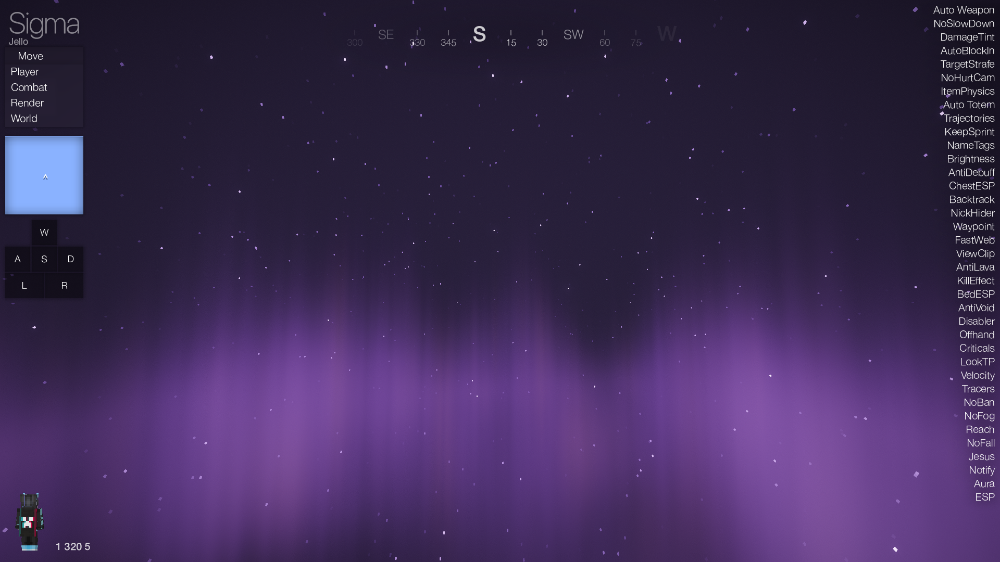
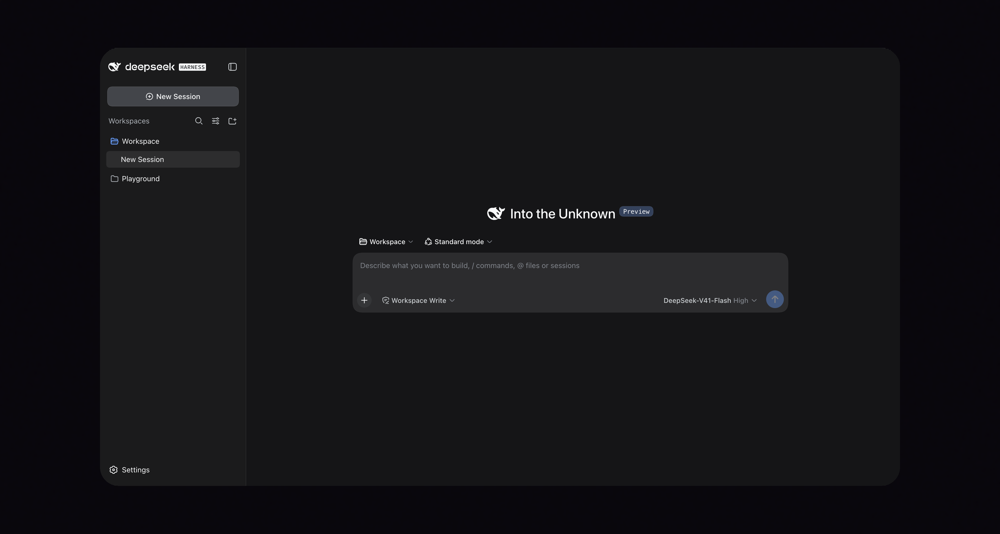

<div align="center">

<h1>Omix Client</h1>
<p><strong>The first AI-native Minecraft Hacked Client in the world.</strong></p>
<p>Minecraft 1.21.11 · Fabric · Java 21</p>

<a href="#快速开始">快速开始</a> ·
<a href="#ai-agent">AI Agent</a> ·
<a href="#java-脚本与外部-mcp">脚本与 MCP</a> ·
<a href="docs/README.md">使用文档</a>

</div>

## 项目简介

Omix 基于 DSJ 的 Remix base 和 Minecraft 1.21.11 / Fabric 开发的我的世界黑客客户端。除了功能模块、ClickGUI、HUD 视觉、音乐播放器和账号管理等常规功能外，该项目也是该领域第一个 AI 原生的客户端。

## 项目截图

<div align="center">

<h3>Visual</h3>


<h3>ClickGUI</h3>


<h3>AI Agent</h3>


<h3>音乐播放器</h3>


</div>

## 核心特色

- **99 个内置模块**：覆盖战斗、协议、移动、玩家、画面与世界交互，支持快捷键和个性化配置。
- **3 种视觉模式**：我们提供 Remix、Myau、Sigma 三种模式的 Hud，ClickGui，以及其它视觉模块。
- **游戏内 AI Agent**：在游戏面板或系统浏览器中使用同一个 Harness，管理模型、工作区、会话和插件。
- **游戏工具接入**：提供 22 个游戏工具与 14 个脚本开发工具，支持状态查询、命令执行、容器交互、数据包观察和脚本开发。
- **Java 脚本工作台**：内置编辑、模板、编译检查、加载、重载和日志查看，可动态注册自定义 AI 工具。
- **外部 MCP**：外部 Agent 可使用与游戏内 AI 相同的游戏工具，并读取脚本 API、参考文档和模板。
- **界面与音乐**：基于 CEF 的 WebUI、自定义主菜单、HUD，以及支持搜索、歌单、专辑、歌词和播放的音乐播放器。
- **账号、代理与配置**：集成账号管理、SOCKS5、FisProxy 会话管理，以及模块状态、按键和 HUD 位置的保存与加载。

## 功能模块

以下数量以当前 `ModuleManager` 的内置注册列表为准，不包含脚本动态注册的模块。点击分类可查看各模块的用途、选项与默认值。

| 分类 | 数量 | 内容 |
| --- | ---: | --- |
| [Combat](docs/modules/combat.md) | 16 | 战斗、武器与攻击辅助 |
| [Exploits](docs/modules/exploits.md) | 9 | 协议控制、数据包观察与路径功能 |
| [Move](docs/modules/move.md) | 18 | 移动、跳跃、速度与防坠落 |
| [Player](docs/modules/player.md) | 17 | 目标筛选、背包、装备与生存辅助 |
| [Render](docs/modules/render.md) | 29 | HUD、WebUI、脚本入口与视觉效果 |
| [World](docs/modules/world.md) | 10 | 搭路、世界交互与自动化 |

## 快速开始

### 安装与启动

1. 准备 **Minecraft 1.21.11** 和 **Java 21**，安装 **Fabric Loader 0.19.3 或更高版本**。
2. 在该游戏实例的 `mods/` 目录中安装对应 Minecraft 版本的 Fabric API；本仓库使用 `0.141.4+1.21.11`。
3. 将构建得到的 Omix JAR 放入同一 `mods/` 目录，使用 Java 21 启动实例。
4. 进入游戏后，按 `Right Shift` 打开 ClickGUI，按 `.` 打开 AI 面板。

首次使用 WebUI 时会检查并按需下载 JCEF 与 Node.js 运行时。请为首次准备保留网络连接和等待时间。

### 默认操作

| 操作 | 默认方式 |
| --- | --- |
| 打开 ClickGUI | `Right Shift` |
| 打开游戏内 AI 面板 | `.`（句点键） |
| 在系统浏览器使用 AI | 输入 `.ai`，点击本地聊天中的链接 |
| 打开脚本工作台 | `.script` 或 ClickGUI → Render → `Scripts` |
| 打开音乐播放器 | ClickGUI → Render → `MusicPlayer` |
| 查看全部命令 | `.help` |
| 查看全部模块 | `.modules`、`.list` 或 `.omix` |
| 查看模块设置 | 输入 `.<module>`，例如 `.speed` |
| 修改模块设置 | `.<module> <setting> <value>` |

按键可通过 `.bind` 修改，已有配置可能覆盖默认值。

## AI Agent

当前 AI 系统使用独立进程运行 **DeepSeek Harness**。模型、API Key、会话、权限和插件均在 Harness 界面中管理。

1. 按 `.` 打开游戏内面板；也可输入 `.ai`，等待服务就绪后点击聊天链接，在系统浏览器打开。
2. 在 Harness 中配置模型与 API Key。
3. 创建任务，描述要完成的操作，例如「查看我的背包和附近容器」或「创建一个可开关的 Sprint 脚本，检查后加载」。

详细说明：[AI 系统](docs/ai-system.md) · [游戏工具及参数](docs/ai-tools.md)。

## Java 脚本与外部 MCP

### Script Studio

输入 `.script` 打开工作台，从 Sprint 等模板创建 Java 脚本，依次执行「检查」和「加载」。保存与检查不会运行代码；编辑后使用「重载」更新运行版本，使用「卸载」释放脚本受管资源并保留源码。 脚本保存在当前游戏目录的 `Omix/scripts/`

语法、生命周期和示例见 [脚本入门](docs/script/README.md) 与 [示例目录](docs/script/examples)。

### 连接外部 Agent

在游戏中运行 `.script mcp`，打开生成的 `mcp-config.json` 即可获取具体 stdio MCP 配置，外部 Agent 工具可使用游戏工具和脚本开发能力。

连接配置与完整工具列表见 [MCP 指南](docs/script/mcp.md)，动态扩展见 [自定义 AI 工具](docs/script/custom-tools.md)。

## 常用命令

所有 Omix 客户端命令都以 `.` 开头，并支持聊天输入补全。

| 命令 | 说明 |
| --- | --- |
| `.help` | 显示命令帮助 |
| `.ai [open/status/restart]` | 获取浏览器链接、查看状态或重启 AI 服务 |
| `.script [open/list/create/check/load/reload/unload/status/logs/mcp]` | 管理 Java 脚本与外部 MCP 配置 |
| `.toggle <module>` | 切换指定模块 |
| `.bind <module> <key/none>` | 设置或移除模块快捷键 |
| `.cfg save [name]` / `.cfg load <name>` / `.cfg list` | 保存、加载或列出配置 |
| `.fis <subcommand>` | 配置并管理 FisProxy 会话 |
| `.modules` / `.list` | 列出全部模块及状态 |
| `.show <module>` / `.hide <module>` | 调整模块在 HUD 中的显示状态 |
| `.<module> [setting] [value]` | 查看或修改模块设置 |

模块名中的空格可省略，例如 `Auto Totem` 写为 `AutoTotem`。文本、颜色和模块内部操作键请在配置界面修改。全部子命令、别名与参数见 [命令参考](docs/commands.md)。

## 代理与 FisProxy

主菜单的 `Proxy` 页面同时支持普通 SOCKS5 代理和 FisProxy。配置 FisProxy API Key 后，可以在界面中查询服务、启动或停止会话、更换出口 IP，并使用返回的连接地址进入服务器；相同能力也可以通过 `.fis` 命令使用。

```text
.fis apikey YOUR_API_KEY
.fis services
.fis start
.fis status
.fis changeip
.fis connect
```

输入 `.fis help` 可查看完整命令与可选参数。

## 开发与构建

### 构建环境

- **JDK 21**。
- **Python 3**：用于生成模块、脚本参考文档和打包 AI 运行时。macOS/Linux 默认使用 `python3`，Windows 默认使用 `python`；可通过 `-PpythonExecutable=/path/to/python` 指定解释器。
- **网络连接**：首次构建需下载 Gradle、Minecraft/Fabric 依赖、Node.js 和 npm 依赖。

使用仓库自带的 Gradle Wrapper，无需预装 Gradle 或 Node.js。Gradle 会下载构建使用的 Node.js，并完成 WebUI、音乐服务、Harness、脚本开发包和参考文档的构建与打包。

### 开发运行与打包

macOS / Linux：

```bash
./gradlew runClient
./gradlew build
```

Windows：

```bat
gradlew.bat runClient
gradlew.bat build
```

`runClient` 启动开发客户端，`build` 构建并执行检查。产物位于 `build/libs/`，安装时选择不带 `-sources` 后缀的 Omix JAR。

本地构建默认只内置当前操作系统和 CPU 架构的 AI 运行时，以缩小 JAR；跨平台分发请使用 `./gradlew build -PaiHarnessPlatform=all`（Windows 使用 `gradlew.bat`）。GitHub CI 的构建与发布仍打包全部六个平台。其他构建选项见 [AI 运行时打包说明](docs/ai-system.md#构建和验收)。

### 检查

macOS / Linux：

```bash
./gradlew check
```

Windows：

```bat
gradlew.bat check
```

## 文档导航

| 文档 | 内容 |
| --- | --- |
| [使用参考](docs/README.md) | 模块分类、配置规则与文档维护 |
| [命令参考](docs/commands.md) | 内置命令、别名和全部选项 |
| [AI 系统](docs/ai-system.md) | Harness 运行、数据目录、插件与故障诊断 |
| [AI Tools](docs/ai-tools.md) | 游戏工具、参数与执行约束 |
| [Java 脚本](docs/script/README.md) | Script Studio、SDK、生命周期与模板 |
| [外部 MCP](docs/script/mcp.md) | 连接配置、工具发现和离线能力 |
| [RotationManager](docs/rotation-manager.md) | 模块与脚本的旋转管理开发说明 |

## 参与项目

欢迎通过 Issue 分享建议、功能构想与使用体验，也欢迎提交 Pull Request。

## 第三方项目

Omix 包含或改编了多个优秀的开源组件。相关许可与版权信息请查看 [THIRD_PARTY_NOTICES.md](THIRD_PARTY_NOTICES.md)。

## 许可证

本项目采用 [MIT 许可证](LICENSE)。第三方组件的许可与版权信息以各自声明为准。