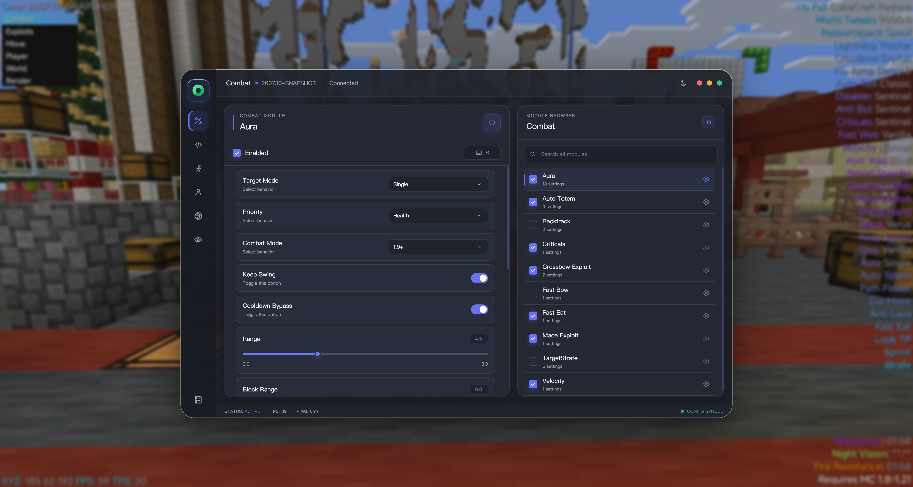
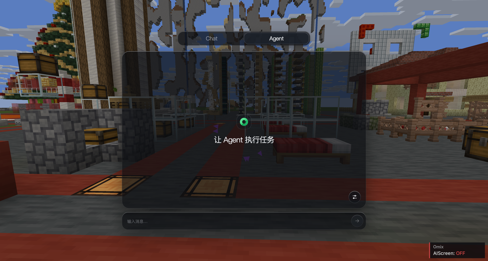

<div align="center">
<h1>Omix-1.21.11</h1>
<h2>Omix — the All in one AI native Minecraft Client for Fabric 1.21.11.</h2>
<h3> 欢迎来到 Omix-1.21.11 仓库，这是一个适用于 Minecraft Fabric 1.21.11 的客户端项目。</h3>
运行环境：构建与运行此项目需要 Java 21。<br>
</div>

## 项目简介

Omix 是基于 DSJ 的 Remix base、面向 Minecraft 1.21.11 并使用 Fabric 构建的一体化客户端。项目集成了丰富的功能模块、AI 助手、现代化界面、音乐播放器、自定义主菜单、账号管理、SOCKS5 与 FisProxy 代理支持，以及配置管理。

## 项目截图

<div align="center">

<h3>ClickGUI</h3>


<h3>AI Agent</h3>


<h3>音乐播放器</h3>


</div>

## 核心特色

- **All in one 客户端体验**：战斗、移动、玩家、世界、视觉与扩展功能集中管理。
- **AI Chat 与 AI Agent**：既能自然对话，也能结合当前游戏状态提供帮助。
- **现代化界面**：内置 ClickGUI、AI 界面、HUD 与自定义主菜单。
- **音乐播放器**：支持音乐搜索、歌单、专辑、歌词和播放。
- **丰富模块**：提供 85 个内置模块，并支持快捷键与个性化设置。
- **配置管理**：可保存模块状态、按键、HUD 位置和常用设置。
- **账号与代理**：主菜单内置账号管理、SOCKS5 代理与 FisProxy 会话管理入口。

## 功能模块

Omix 当前包含 **85 个内置模块**：

| 分类 | 数量 | 内容 |
| --- | ---: | --- |
| Combat | 12 | 战斗辅助与目标管理 |
| Exploit | 8 | 扩展与特殊功能 |
| Move | 16 | 移动体验与操作辅助 |
| Player | 15 | 玩家、背包与生存辅助 |
| World | 8 | 世界交互与自动化 |
| Render | 26 | HUD、界面与视觉效果 |

## AI 能力

AI WebUI 提供两种模式：

- **Chat**：进行自然语言对话。
- **Agent**：结合当前游戏状态读取信息、执行命令并协助完成操作。

可以在 AI 界面的设置中完成配置，也可以使用聊天命令：

```text
.ai baseurl https://api.example.com
.ai apikey YOUR_API_KEY
.ai model YOUR_MODEL
.ai think true
```

开始对话：

```text
.chat 你好，请介绍一下我当前的游戏状态
```

也可以按下默认快捷键 `.` 打开 AI 界面。

## 默认操作

| 操作 | 默认方式 |
| --- | --- |
| 打开 ClickGUI | `Right Shift` |
| 打开 AI 界面 | `.`（句点键） |
| 打开音乐播放器 | 在 ClickGUI 中启用 `MusicPlayer` |
| 查看全部命令 | `.help` |
| 查看全部模块 | `.modules`、`.list` 或 `.omix` |
| 查看模块设置 | 输入 `.<module>`，例如 `.speed` |
| 修改模块设置 | `.<module> <setting> <value>` |

## 常用命令

所有 Omix 客户端命令都以 `.` 开头，并支持聊天输入补全。

| 命令 | 说明 |
| --- | --- |
| `.help` | 显示命令帮助 |
| `.ai <option> [value]` | 查看或修改 AI 配置 |
| `.chat <message>` | 与 AI 对话 |
| `.toggle <module>` | 切换指定模块 |
| `.bind <module> <key/none>` | 设置或移除模块快捷键 |
| `.cfg save/load/list` | 保存、加载或查看配置 |
| `.fis <subcommand>` | 配置并管理 FisProxy 会话 |
| `.modules` / `.list` | 列出全部模块及状态 |
| `.show <module>` / `.hide <module>` | 调整模块在 HUD 中的显示状态 |
| `.<module> [setting] [value]` | 查看或修改模块设置 |

## 代理与 FisProxy

主菜单的 `Proxy` 页面同时支持普通 SOCKS5 代理和 FisProxy。配置 FisProxy API Key 后，可以在界面中查询服务、启动或停止会话、更换出口 IP，并使用返回的连接地址进入服务器；相同能力也可以通过 `.fis` 命令使用。

```text
.fis apikey YOUR_API_KEY
.fis services
.fis start
.fis status
.fis changeip
.fis connect
```

输入 `.fis help` 可查看完整命令与可选参数。

## 环境要求

- Minecraft 1.21.11
- Java 21
- Fabric Loader
- Fabric API
- Windows、macOS 或 Linux

## 快速开始

### 开发运行

macOS / Linux：

```bash
./gradlew runClient
```

Windows：

```bat
gradlew.bat runClient
```

### 构建

macOS / Linux：

```bash
./gradlew build
```

Windows：

```bat
gradlew.bat build
```

构建产物位于：

```text
build/libs/
```

### 安装

1. 为 Minecraft 1.21.11 安装 Fabric Loader。
2. 在对应实例中安装 Fabric API。
3. 将 `build/libs/` 下不带 `-sources` 的 Omix JAR 放入游戏实例的 `mods/` 目录。
4. 使用 Java 21 启动该 Fabric 实例。

## 测试

```bash
./gradlew check
```

## 参与项目

欢迎通过 Issue 分享建议、功能构想与使用体验，也欢迎提交 Pull Request。

## 第三方项目

Omix 包含或改编了多个优秀的开源组件。相关许可与版权信息请查看 [THIRD_PARTY_NOTICES.md](THIRD_PARTY_NOTICES.md)。

<div align="center">

## Licence
    MIT

详见 [LICENSE](LICENSE)。

</div>
